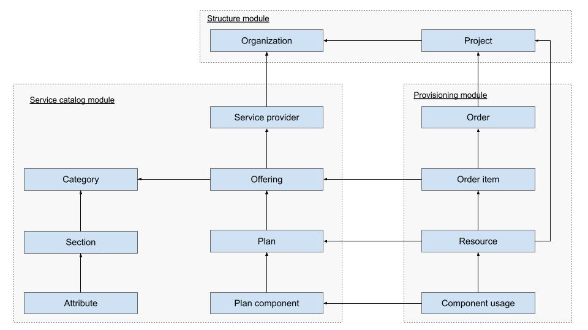

# Marketplace

Marketplace is a central module for provisioning of Waldur resources. Marketplace contains Offerings that
belong to a special type of Organizations - Service Providers. Marketplace provides common functionality
for resource lifecycle management, accounting and invoicing. Specifics are implemented in the Marketplace plugins
(e.g. for OpenStack, SLURM, Rancher, etc).

## Diagram of concepts



## Adding a new Offering

To create a new Offering in the Marketplace, you need to:

- Assure that categories are configured in the Marketplace.
- Create at least one service provider.
- Create and activate a public offering.

### Creating Marketplace categories

To create a category, either use administrative interface of Waldur, hosted under ```/admin`` (can be accessed by staff users)
or use management command for loading the pre-defined categories.

- With Docker-compose deployment:

```bash
  docker exec -t waldur-mastermind-worker waldur load_categories  # vpc vm storage ...
```

- With Helm deployment

Open waldur-mastermind-worker shell and execute the following command:

1. Get waldur-mastermind-worker pod name

```bash
  # Example:
  kubectl get pods -A | grep waldur-mastermind-worker # -->
  # default       waldur-mastermind-worker-6d98cd98bd-wps8n   1/1     Running     0          9m9s
```

1. Connect to pod via shell

```bash
  # Example:
  kubectl exec -it waldur-mastermind-worker-6d98cd98bd-wps8n -- /bin/bash
```

1. Execute command to see available or add a category

```bash
  waldur load_categories  # vpc vm storage ...
```

## Service offering configuration guide

### Overview

This guide provides a structured approach for integrators to define an Offering within an organization. Offerings represent services, resources, or products made available through the platform. The configuration of an offering includes General Information and Public Information, ensuring clarity, accessibility, and compliance with organizational policies.

### General information

The General Information section defines the core attributes of an offering, including its identity, accessibility, and governance policies.

#### Required fields:

- **Name** – The title of the offering, displayed across the platform
- **Description** – A concise summary outlining the offering's purpose
- **Full description** – A detailed explanation, including technical aspects and potential use cases
- **Terms of service** – Any contractual obligations or usage restrictions
- **Privacy policy link** – URL linking to the privacy policy
- **Terms of service link** – URL linking to the terms of service
- **Access URL** – The main entry point for users to access the offering
- **Slug** – A unique identifier used in URLs
- **Location** – The geographical or virtual location of the offering
- **Access policies** – Defines access control rules and user eligibility
- **Logo** – A graphical representation of the offering
- **Getting started instructions** – Guidelines on how users can begin using the offering

### Public information

The Public Information section ensures visibility and accessibility for end users. It includes Endpoints, Categories, and Images.

#### Endpoints

Endpoints provide connectivity to the offering's services. Each endpoint requires:

- **Name** – A human-readable identifier for the endpoint
- **URL** – The direct link to access the service

#### Images

Images provide visual representation and marketing appeal. Each image requires:

- **Name** – A descriptive title
- **Description** – A brief explanation of the image content
- **Attached image file** – The image file itself

#### Category

The Category classifies the offering within a predefined structure. It can be selected from an existing list or manually edited to include additional metadata. The category section contains multiple attributes:

##### Security & certification
- **Security certification** – Defines compliance standards and certifications

##### Support
- **E-mail** – Contact email for support inquiries
- **Phone** – A support phone number
- **Support portal** – URL for submitting support requests
- **Description** – Overview of the support scope and availability
- **ToS link** – Link to the Terms of Service document

##### Location
- **Address** – The physical or virtual address of the service

##### Performance
- **Peak TFlop/s** – Maximum floating point performance
- **Linpack TFlop/s** – Performance benchmark using Linpack

##### Node information
- **CPU model** – Type of processor used
- **GPU model** – Type of graphical processing unit
- **Memory per node (GB)** – Amount of RAM per node
- **Local disk (GB)** – Storage available per node
- **Interconnect** – Network interconnect specifications
- **Node count** – Total number of nodes in the infrastructure

##### System information
- **Queueing system** – The workload scheduling system
- **Home space** – Storage allocation for user home directories
- **Work space** – Storage allocation for working directories
- **Linux distribution** – The Linux OS variant running on the infrastructure

##### Software
- **Applications** – List of pre-installed applications available to users

##### Quality of service (QoS)
- **QoS of network** – Performance metrics related to network services
- **QoS of storage** – Performance guarantees for storage access