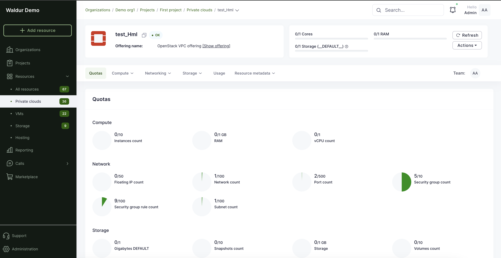
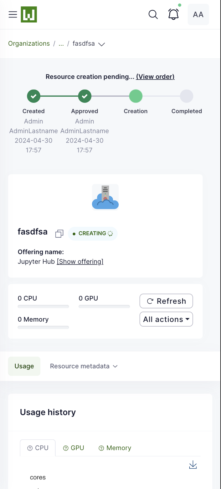

# HomePort requirements

## Overview

Homeport is a React-based application for interacting with Waldur Mastermind via browsers.
It is intended for end-users as well as administrative roles.

## Mobile-friendliness

All Homeport screens should be usable with mobile resolution.

<figure markdown="span">
  
  <figcaption>Resource details (desktop)</figcaption>
</figure>

<figure markdown="span">
  { width="250" }
  <figcaption>Resource details (mobile)</figcaption>
</figure>

## Localization

All labels should be wrapped by translation tags to allow easy translations.

For details see [instructions for developers](ui/i18n.md).

## Accessibility and WCAG compliance

Homeport is being used by human end-users and hence is developed according
to the [WCAG](https://www.w3.org/WAI/standards-guidelines/wcag/) guidelines.

In particular, the following is followed:

1. Static and dynamic linters for assuring that generated user interface conforms to technical requirements of WCAG (anchors, required attributes, etc).
2. Usage of WCAG compliant colors in UI theme, provisioning of dark and light modes.
3. Navigation is designed to be in compliance with WCAG 2.0 requirements.
4. Manual testing for WCAG violations.
