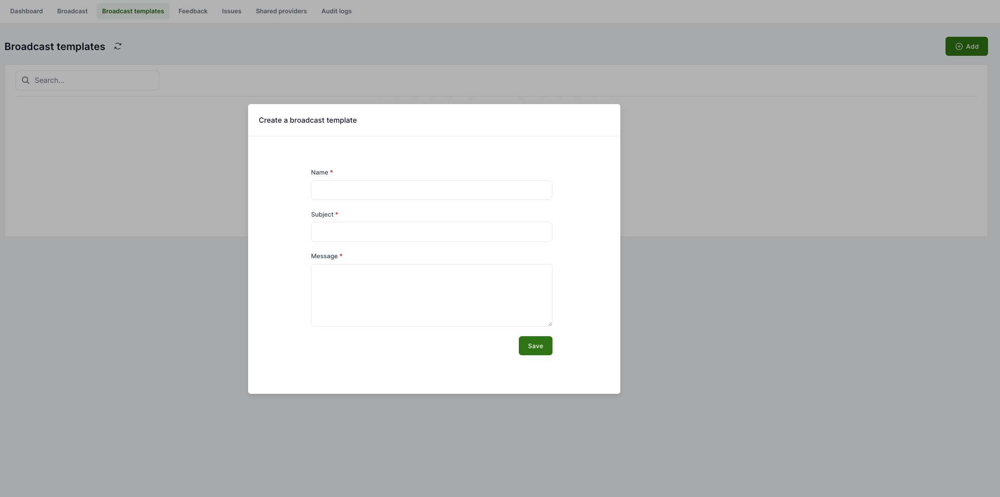

# Broadcast

The broadcast functionality allows you to send messages to specific groups of users within Waldur. You can target messages to the following:

* Offering users
* Organization members
* All users connected to your Waldur deployment

## Management of broadcast messages

To manage broadcast messages, follow these steps:

* Select **Support** from the left-side menu.
* Click **Broadcast** in the top menu.

The Broadcast Management page shows both sent messages and drafts. From here, you can view message history and create new broadcasts.

## Broadcast templates

You can create broadcast message templates, which is useful for sending certain types of messages frequently (e.g., maintenance announcements).

To create a new template:

* Navigate to **Support** → **Broadcast templates**.
* Click **Add**.

A popup will appear with the following fields:

* **Name**: Name of the template
* **Subject**: Subject line for the broadcast message
* **Message**: Content of the message

## Creating new broadcast message

To create a new broadcast message:

* Navigate to **Support** → **Broadcast**.
* Click **Add**.

A popup will appear with the following fields:

* **Template**: Select a predefined template (optional)
* **Subject**: Subject line for the broadcast message
* **Message**: Content of the message
* **Send at**: Schedule a send time for the message, or leave blank to send immediately

You can then either save the message as a draft for later editing or save it as a template for future use.

If everything looks good and you would like to send it out, click **Select recipients**.

### Selecting Recipients

In this step, you can define the target users for the broadcast message:

* Specific offering(s) users
* Specific organization(s) members
* All users connected to your Waldur deployment

Once you're ready, click **Send broadcast**.

