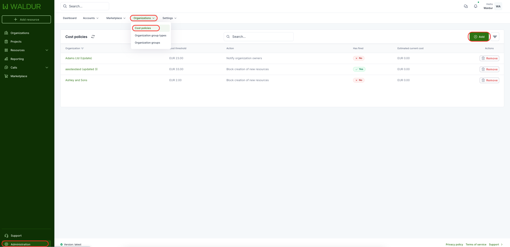
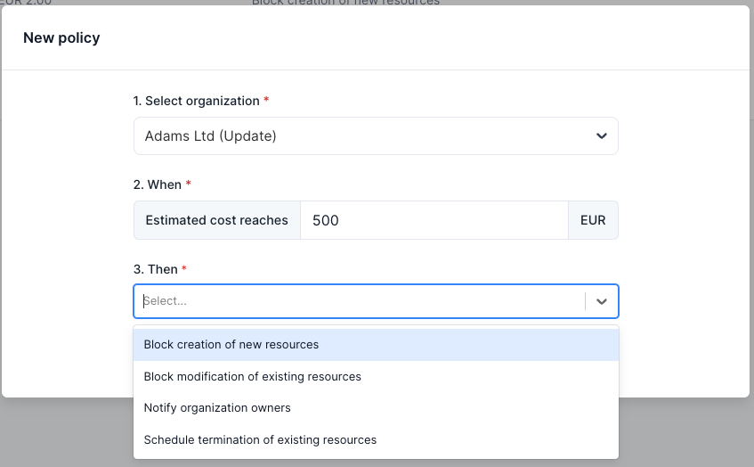
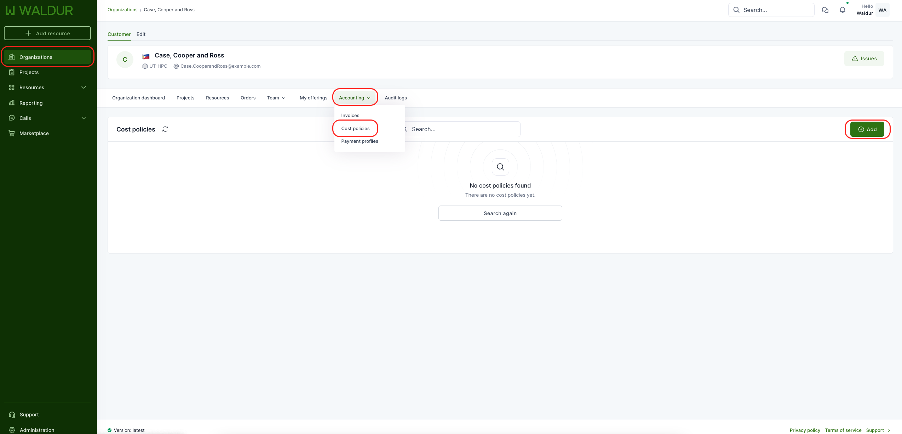
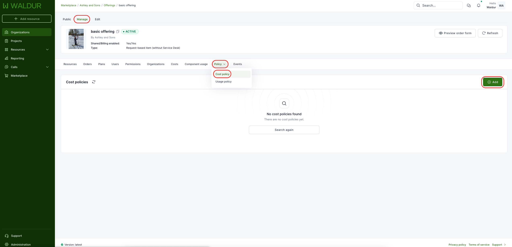
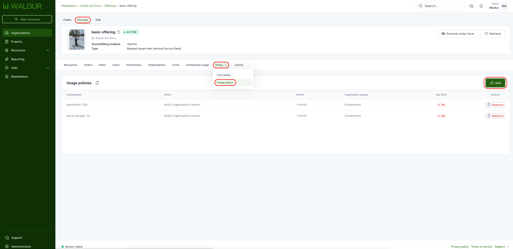
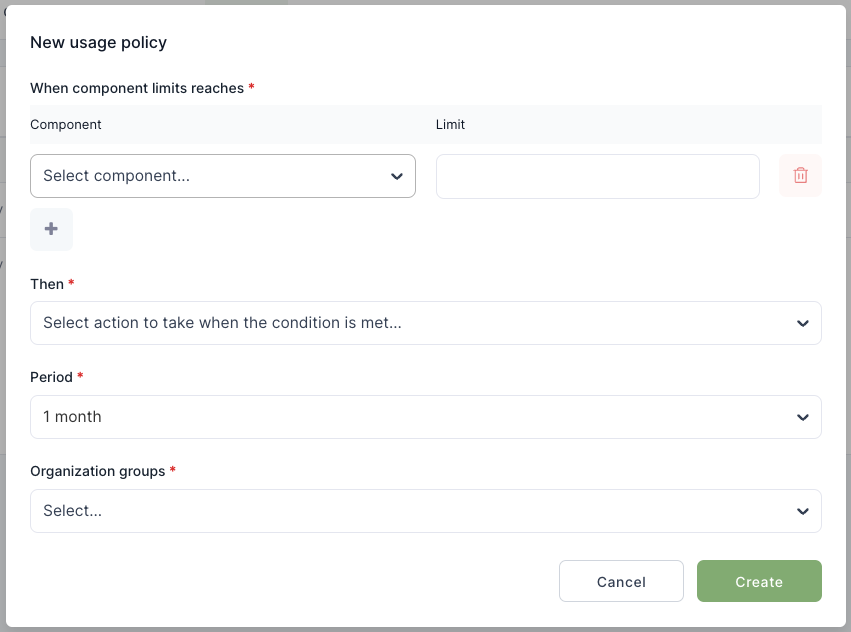

# Cost and usage policies

Waldur allows to set different cost and usage policies on organization, project and offering level. For example, this means that organization owners and service providers can enable different actions, when cost or usage exceedes predefines level.

## Cost policies for organizations

Staff role can define cost policies for organizations. To add a new policy, open Administrations menu from the left and then Organizations -> Cost policies from the top. This view provides an overview about already defined policies. To create a new one, select "Add" from the right.
    

From the popup, select organization, then set estimated cost limit and finally choose the action (what happens, when the limit is reached).
    

## Cost policies for projects

Organization owners can set different cost policies for projects under particular organization. To add a new policy, open Organizations menu from the left and then Accounting -> Cost policies from the top. This view provides an overview about already defined policies. To create a new one, select "Add" from the right.
    

From the popup, select project, then set estimated cost limit and finally choose the action (what happens, when the limit is reached).
    

## Cost policies for offerings

Offering managers can set cost policies for specific organization groups. This allows to trigger some actions, when cost is reached. To add new policy, offering manager should open offering management page (Organization from the left menu, then Service provider -> Marketplace -> Offering) and then Policy -> Cost policy from the top. This view provides an overview about already defined policies. To create a new one, select "Add" from the right.
    

From the popup, set estimated cost limit, choose the action what happens after cost is reached (block creation of new resources or notifying the organization owners). Then, it is needed to select period (is this policy per month, quarter, annual or total) and finally select organization group for which this policy applies to.
    

## Usage policies for offerings

Offering manager can set different usage policies for specific organization groups. This allows to trigger some actions, when usage of defined resource component is reached. To add new policy, offering manager should open offering management page (Organization from the left menu, then Service provider -> Marketplace -> Offering) and then Policy -> Usage policy from the top. This view provides an overview about already defined policies. To create a new one, select "Add" from the right.
    

From the popup, select accounting component and set limit for that. Several compoments can be defined in one policy. Then, it is needed to select period (is this policy per month, quarter, annual or total) and finally select organization group for which this policy applies to.
    