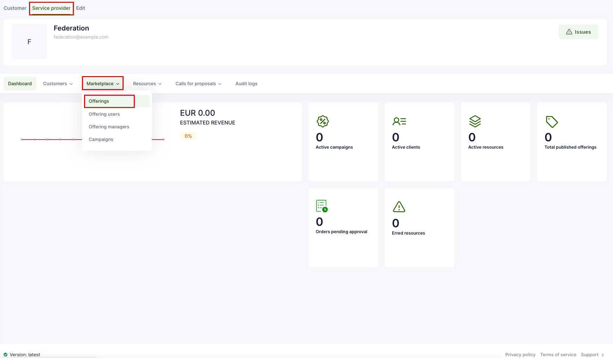
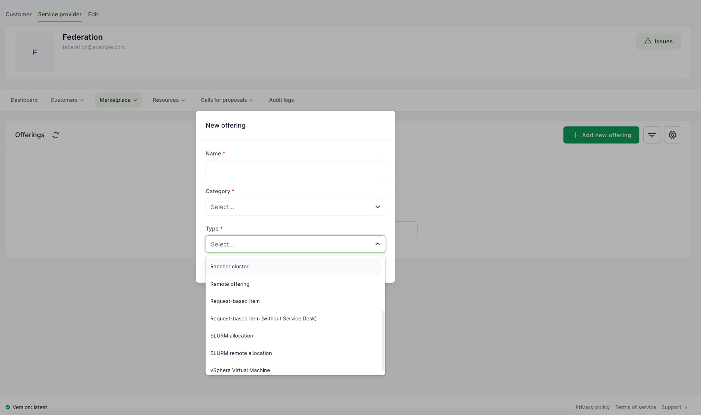
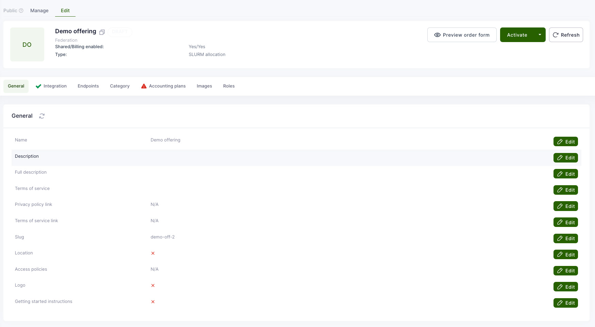
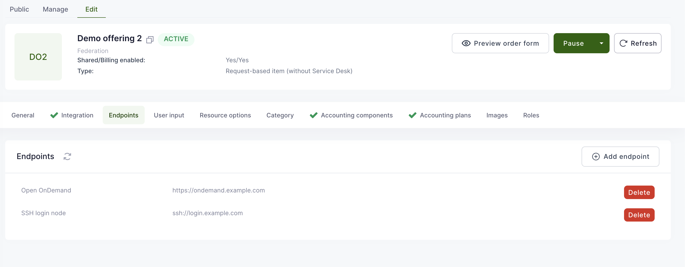
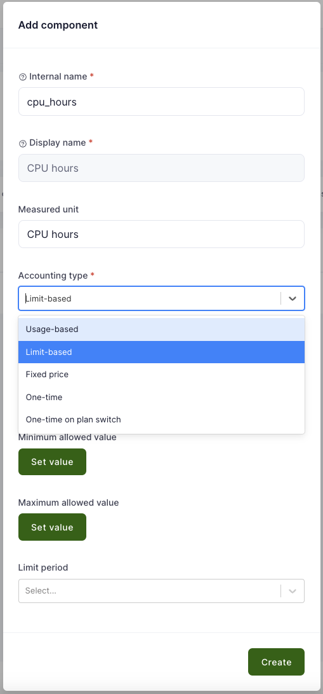
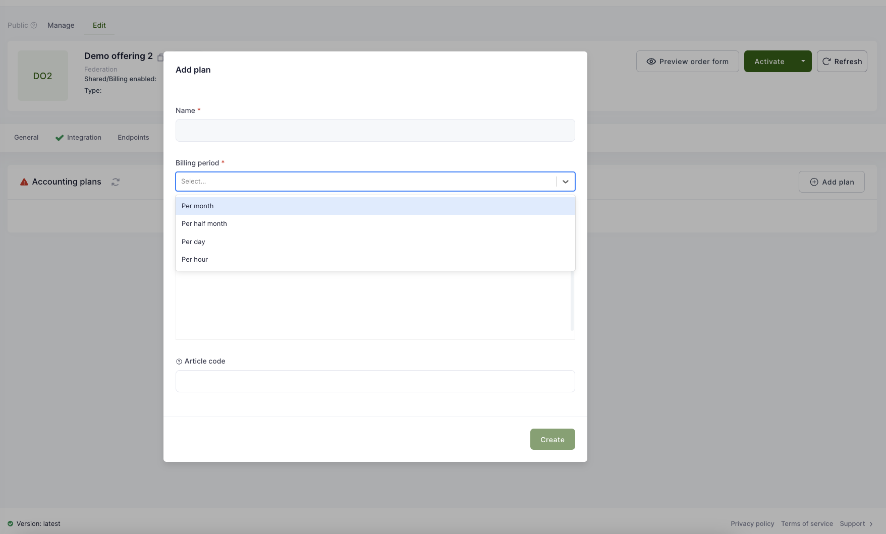
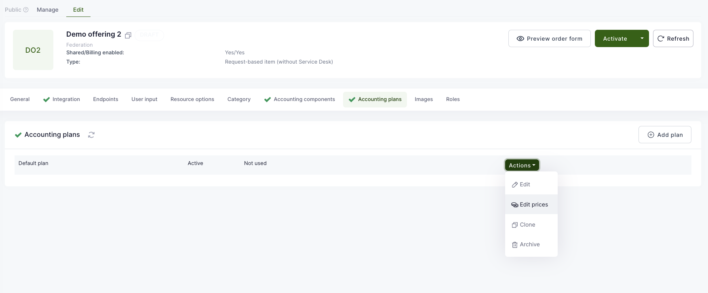
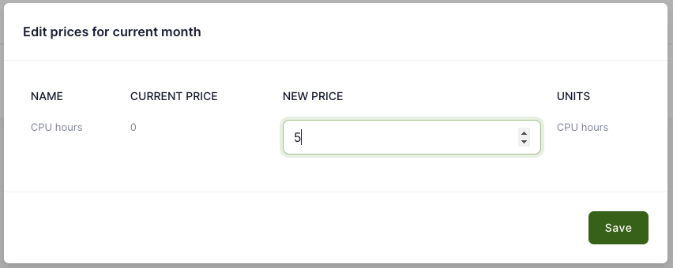

# Offerings

## Offering creation

Waldur supports a number of different types of service providers when creating a shared offering. A common way of
creating an offering is through a HomePort.

1. Select organization, which will provide the offering.

2. Go to Provider dashboard and click on "Marketplace" -> "Offerings" -> "Add new offering":
    

3. Click on "Add new offering" and fill in the name for the offering, category and type:
    

4. Offering details page opens, where you can add additional information:
    

5. Under Endpoints section, you can add access endpoints for the offering, for example, management consoles, SSH login nodes or similar.
    

    This configuration will display then to resource of the offering a menu for easier navigation to the corresponding services. For SSH protocol this would trigger
    opening of an SSH client if configured for the browser. Out of the box works on OS X and Linux, requires configuration of the default application on Windows.
    

6. To add accounting components, select "Accounting components" from the top menu and then "Add component" from the right side. Accounting component is a measurable unit of a resource. For example, it can be CPU hours, GPU hours, storage hours, RAM etc.
    

7. A popup opens with possibility to configure fields and select the accounting type (whether the component is billed by the usage, max limit or it has a fixed price).

    - Usage-based - billing is applied according to the actual usage of the resource during the billing period defined in the accounting plan after the submission of a usage report;
    - Limit-based - billing is applied according to the requested/updated limits of a resource, actual usage can be below the limits and it is not the basis of the billing;
    - Fixed price - billing is applied according to the exact values defined by the service provider in the accounting plan, limits and usage are not the basis for the accounting;
    - One-time - billing is applied once on resource activation;
    - One-time on plan switch - billing is applied once on resource activation and everytime a plan has changed, using pricing of a new plan.

    

8. To configure accounting frequency and prices, select "Accounting plans" from the top menu and then "Add plan" from the right. Select a name for the plan and accounting frequency:
    

9. To define prices for the components, select "Actions" and then "Edit prices". Set new price and save. If there is a need to provide higher priority access to resources with different prices, then it is advised to create another offering for this kind of cases.
    

    

10. If all set, click "Activate" on the top-right side to make it visible to everybody.
    

!!! tip
    For more advanced cases of management of offerings, take a look at how a SLURM offering can be managed using
    [Ansible module](https://github.com/waldur/ansible-waldur-module/blob/develop/waldur_batch_offering.py).