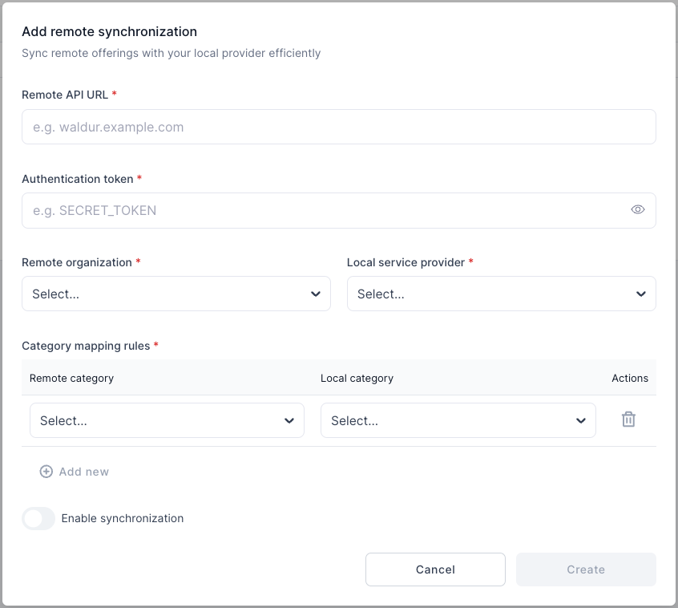

# Remote sync of offerings

Remote sync functionality allows you to import offering information from another Waldur instance and periodically update it.

## Prerequisites

1. The remote Waldur instance must have at least one organization with at least one offering.
2. An integration user must be created under the organization in the remote Waldur instance. Its token is needed in the creation step.
3. Category mapping analysis must be completed. This involves mapping the remote offering categories to the local ones.

## Remote offering sync management

To manage existing offering syncs, follow this process:

1. Log in to the local Waldur instance, open the **Administration** menu, and select **Marketplace** -> **Remote Offering Sync** from the top menu.
2. The Remote Offering Sync Management page opens.

    

3. From this page, you can create a new sync, edit an existing one, or delete a sync.

    - **Enable/Disable**: Temporarily enable or disable the sync for a particular remote instance.
    - **Synchronize**: Perform a one-time manual sync.
    - **Show Results of Last Run**: View what was imported during the last sync.
    - **Edit**: Modify the configuration of a particular sync.
    - **Delete**: Remove a remote instance sync.

## Creating new remote offering sync

1. Go to the Remote Offering Sync Management page and click **Add**.
2. A popup will open with the necessary fields to be filled in.
3. Fill in the required fields:

    - **Remote API URL**: The API URL of the remote Waldur instance. This is typically the User Interface URL with /api at the end.
    - **Authentication token**: The integration user’s authentication token from the remote Waldur instance.
    - **Remote organization**: Select the remote organization that will request orders in remote Waldur, and whose visibility scope determines which offerings are imported from remote Waldur.
    - **Local service provider**: Select the local service provider organization under which the imported offerings will be published.
    - **Category mapping rules**: Map the remote offering categories to the local ones.
    - **Enable synchronization**: Enable the sync now, or leave it disabled and enable it later.
    - Click **Create**.

    

4. If remote sync is enable, then local Waldur periodically (once per day) pulls inormation about offerings from the remote instance.
