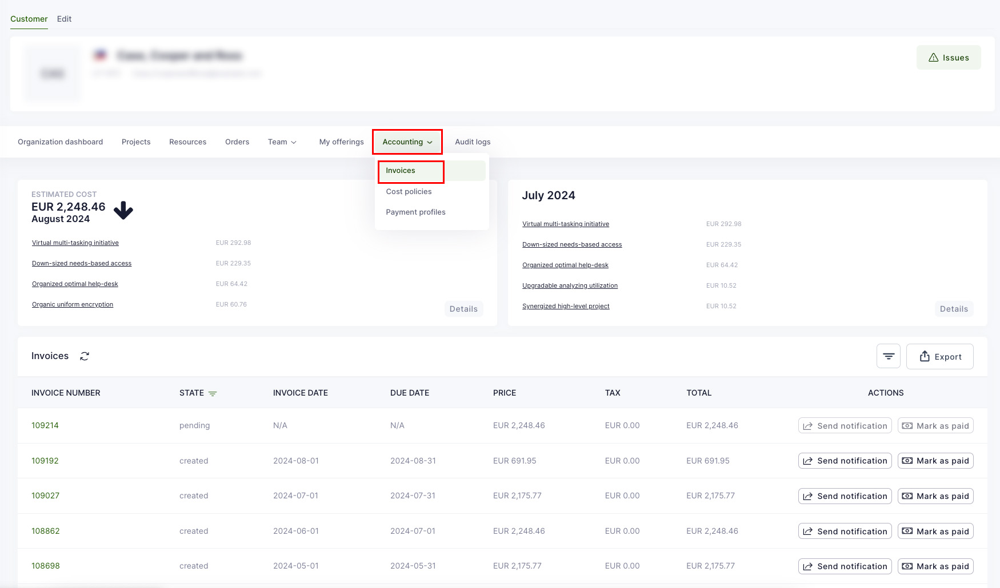

# Accounting and usage reports

## Accounting

### Service provider revenue

If the organization is service provider, then it is possible to check the amount of revenue of a running month. To do that, open the organization dashboard, choose "Service provider" view and then dashboard opens. There you will see the total amount of estimated revenue and also 11 previous months.

By clicking on "Active clients" on the left, it's possible to see more detailed information about clients and amounts.
   

### Invoices

Waldur provides a convenient way to see the invoices issued to the organization. Open the organization dashboard and select “Accounting” from the top menu and then “Invoices”. Now you’re able to see all invoices issued to the organization.
   

Invoices’ information can be downloaded in different formats as well.
   

### Estimated cost

Estimated cost of a running month can be seen from the same view as invoices. By default, it shows top 4 projects with the highest cost. By clicking “Details”, you are able to see all projects with estimated costs.
   

## Usage of a resource

To view the usage information within a project:

1. Open your project in Waldur.

2. Select the allocation (resource) that usage report you would like to see.

3. On this window, Select "Usage" to see the usage of a resource. Use tabs "CPU Allocation", "GPU Allocation", and "Storage Allocation" to see the details.
   

4. By default, the view shows last 6 months information. To see the usage from the creation of a resource, please use period selector on the right side.
   

5. Instead of graph view, it is possible to switch to table view as well. To do that, please use switching button on the right next to the period selector.
   

6. It is possible to download the graph views as PNG images. To do that, please use the arrow icon on the right side of the graph.
   

To check the current resource allocation limit:

1. On the same window, the plan details for Allocation components (CPU, GPU, and storage) can be found on the top-right side.
   